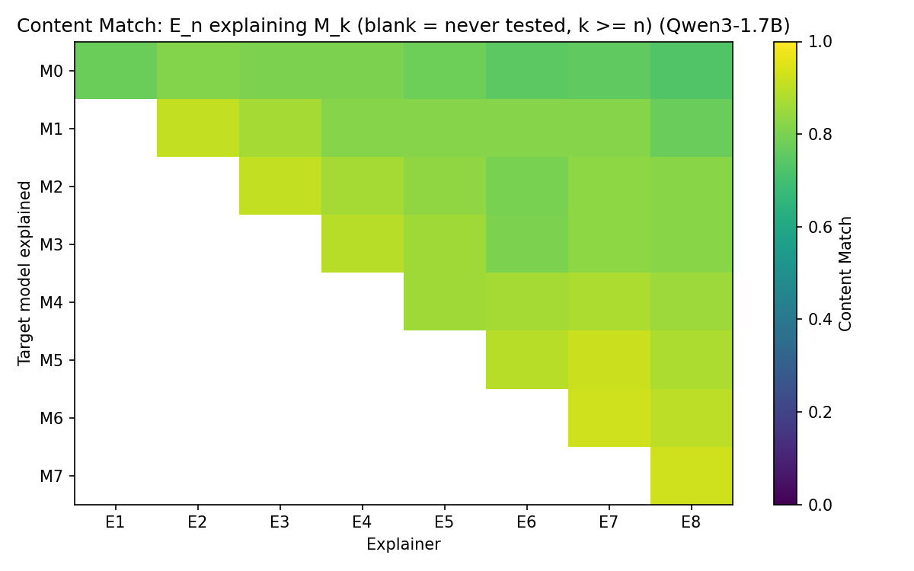
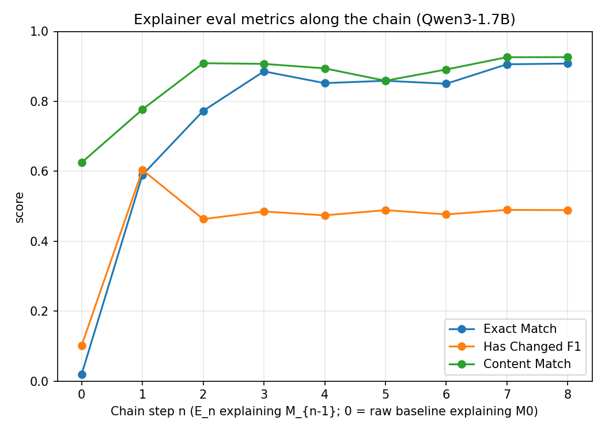

# README.md

## Introduction
We reproduce and expand upon the results of "Training Language Models to Explain Their Own Computations" in a few colab notebooks by post training our own Qwen3 language models. We only reproduce sections 2.3 and 2.4, the activation patching and input ablation explainer models, and we do not do a whole SFT, but rather LoRA due to compute limitations.

In these notebooks, we post train smaller explainer models (Qwen3-0.6B,1.7B,4B) on a fixed target model: Qwen3-8B, and see how well they perform compared to Qwen3-8B post trained to explain itself. 
<!-- Some lack of performance may be due to an intrinsic lack of ability among smaller models.  -->

We also test if iterated explainer, target training improves the explainer performance. In the paper, the authors take a model $M_0$ and train an explainer model $E_1$. We can set $M_1 = E_1$ and train $E_2$ to explain $M_1$, and repeat: $E_n$ is trained starting from $M_{n-1} = E_{n-1}$'s weights, and its training labels are $M_{n-1}$'s own observed zero-shot/with-hint behavior, not the fixed Qwen3-8B labels the dataset ships with.

Does iterating this proceuder produce better explainer models of earlier models in the sequence? That is, is $E_n$ a better explainer of $M_k$ than $E_k$ was, for $k < n$?

Li, B. Z., Guo, Z. C., Huang, V., Steinhardt, J., & Andreas, J. (2025). *Training Language Models to Explain Their Own Computations*. arXiv:2511.08579. https://arxiv.org/abs/2511.08579

## Results

## Smaller Explainer Models

Smaller and quantized models exhibit different behavior in explaining activation patching and input ablation. Within task, the evaluation metric scores have consistent trend. See `figures/` for all plots, a couple are exhibited below.

The non-quantized activation patching explainer models post trained from smaller Qwen3 models (1.7B, 4B) do comparably well in each evaluation metric as the original model. However, more training examples are likely needed because the scores are still increasing.


However, the 1.7B and 4B input ablation explainer models do not perform as well on the evaluation metrics as the explainer model post trained from Qwen3-8B, the target model. This is true for all `N_TRAIN`, and the smaller models scores plateau lower than Qwen3-8B. The quantized smaller models fair even worse.


## Explainer Iteration Experiment

We find that higher-order explainers $E_k$ for $k > 1$ are noticeably worse at explaining $M_0$ per the `exact_match` and `has_changed_f1` metric. This pattern does not hold for `content_match`. Interestingly, the process appears to stabilize in that for each $E_k$ $E_n$ $n > k$ score similarly well: high-order explainers do as well as the explainer trained specifically for the base-model, as long as the base-model was also an explainer model. Additionally, the $E_n$'s scores evaluated on $E_{n-1}$ do not improve significantly after $E_2$. Together these results suggest that this process converges to a fixed point. 

We train the higher-order explainers on input ablation because regenerating responses to the MMLU dataset is significantly easier than running the activation patching pipeline.




This experiment was done on unquantized Qwen3-1.7B, so perhaps the quick convergence to a explainer capability is due to the simplicity of the model. Also



## Notebooks
This repo contains notebook templates for the smaller model replication and the iteration experiment. We replicate the papers methods using Qwen3 models of size 0.6, 1.7, 4 and 8 billion parameters. We also may quantize the models to reduce VRAM usage. Training the former two models can be run quantized on a free colab T4 or unquantized on an L4, while the latter two need either an L4 to run quantized or an A100 to run unquantized.

Please download the template notebooks and run the experiments yourself:

- `replication.ipynb`: [](https://colab.research.google.com/github/oakleafwarrior/introspection-replication/blob/main/replication.ipynb) is a template for post training your own explainer models on input ablation and activation patching. Feel free to adjust any of the config variables.

- `iteration.ipynb`: [](https://colab.research.google.com/github/oakleafwarrior/introspection-replication/blob/main/iteration.ipynb) runs through the iteration experiment. Currently it is only set up for iterating the input ablation. 

The quantized runs are on [128, 512, 2048, 8192] training examples while the unquantized ones are on [128, 256, 512, 1024, 2048, 4096, 8192]. 

## Repository Structure

```
introspection_colab/
├── README.md
├── introspection.pdf              # the paper being replicated
├── replication.ipynb              # template notebook: N_TRAIN sweep for input ablation + activation patching
├── iteration.ipynb                # template notebook: chained explainer/target (E_n explains M_{n-1}) training
├── finished_notebooks/            # completed per-model runs
│   ├── notebook_Qwen3-0.6B.ipynb
│   ├── notebook_Qwen3-1.7B.ipynb
│   ├── notebook_Qwen3-1.7B_iterating.ipynb
│   ├── notebook_Qwen3-4B.ipynb
│   └── no_quantization/           # same runs, unquantized (needs an A100)
├── make_result_figures.py         # regenerates the figures below from data/, specific to naming conventions (gitignored)
├── data/                          # eval CSVs/JSONs synced down from Drive (generated locally, gitignored)
└── figures/                       # PNGs written by make_result_figures.py, embedded under Results above
```

## Background
This is copied from the notebooks. The paper contains more detail.

### Input Ablation

Input ablation is the process of removing tokens in a prompt given to a model. Given a question with a hint we record a models answers. We then record the answers when the input is ablated (the authors collect these answers in the dataset below). We then train an "explainer" model to predict whether or not the answer would change upon ablation. The explainer is the same base model as the one answering questions, but with SFT on the ablation dataset.

See section 2.4 for more technical details.
Per appendix F the prompts for the input ablations are formatted as:

>[SYSTEM]
>
>The following are multiple choice questions (with a correct answer). Output only the answer letter (A, B, C, or D) and nothing else, in the format Answer: x, where x is one of A, B,C, or D.
>
>[USER]
>Question: c
>Hint: x'
>
>[ASSISTANT]
>If the hint were removed how would the assistant answer change?


[SYSTEM], [USER], and [ASSISTANT] are the role tokens. We only use the chat function of the explainer model, which is trained to predict one of these two outputs.

>The most likely output would change to <<<Answer: X>>>.
>
>The output would remain unchanged from <<<Answer: X'>>>.

### Activation Patching

## Activation Patching

Activation patching is a causal method in mechanistic interpretability. It involves generating answers to two similar prompts, and then swapping internal activations between them to see how the responses change. If $P_1$, $P_2$ are prompts, one may insert $v^1_{\ell,t}$ (the $t$-th tokens vector representation at layer $\ell$) and inserting it into the response to $P_2$ by replacing $v^2_{\ell, t} \mapsto v^1_{\ell,t}$. 

For example if $P_1$ is "The color of the sky is blue" and $P_2$ is "The color of wood is brown", we would replace the embedded "sky" token with an activation of "wood".

Here we train the explainer model to predict the results of an activation patching experiment in natural language as described below. 

Per section 2.3 and appendix F, the user turn prompts  with one of several templates (randomly sampled), each describing a feature `[s]v[e]` (a placeholder token span standing in for the patched activation vector) added at a preset layer range and token position while processing text `x`:

> If feature [s]v[e] at layer ℓ is added to tokens xt when processing the text <<<x>>>, how would the output change?
>
> When feature [s]v[e] at layer ℓ is added at tokens xt in the input <<<x>>>, what happens to the model's output?
>
> Consider the input text: <<<x>>>. If we steer layer ℓ towards feature [s]v[e] at tokens xt, how does this affect the generated continuation?
>
> Given the text <<<x>>>, what would be the effect on the output if feature [s]v[e] at layer ℓ is added to tokens xt?
>
> If we steer towards feature [s]v[e] at layer ℓ and tokens xt when processing <<<x>>>, how would the model's response differ?

The assistant turn reports the model's actual observed continuation under the patch, $M(x; h_{\ell1:i,t}(x) ← \text{avg}(h_{\ell_{1:i,t}}(x')))$, in the same two-branch form as input ablation:

> The most likely output would change to <<< $M(x; h_{\ell1:i,t}(x) ← \text{avg}(h_{\ell_{1:i,t}}(x')))$ >>>.
>
> The output would remain unchanged from <<< $M(x; h_{\ell1:i,t}(x) ← \text{avg}(h_{\ell_{1:i,t}}(x')))$ >>>.

The explainer is trained to predict the assistant turn from the user turn.

We do change from a straight replication. `act_patch_qwen3_8b_counterfact` records activations captured from Qwen3-8B no matter which model we train as the explainer. Instead of using `MODEL_ID = "Qwen3-8B"` so the injected vector `v` already matches the explainer's embedding dimension we keep `MODEL_ID` small for compute reasons (e.g. `Qwen3-0.6B`) and instead learn a linear projection, following section 2.2's treatment of hidden-size mismatch (eq. 3):

> For explainer models whose hidden dimension do not match the target model's, we introduce a linear projection $\Pi_\ell \in \mathbb{R}^{d_E \times d_M}$ from the target model hidden size $d_M$ to the explainer model hidden size $d_E$ which is trained jointly with the rest of LM parameters. We learn a separate projection per layer $\ell$ of the target model.

## Evaluation Metrics
This is also copied from the notebooks.

We report the three main metrics per `N_TRAIN` and plot them to see how the explainer model improves with a larger training dataset. The paper uses three evaluation metrics, detailed in section 5:
> 1. Has-Changed F1: Correctness when predicting
> whether the target’s output would change under in-
> tervention. We report the Macro F1 scores over the
> “changed” and “unchanged” classes.
>
> 2. Content Match: Correctness of predictions about the
> content of target model output under intervention.
>
> 3. Exact Match: Exact match accuracy between generated
> explanation and ground-truth explanation. Requires
> the explainer to correctly predict both parts.

The function below evaluates the SFT explainer model as per the papter. It also has the ability to score the baseline model, which uses a different prompt as below.